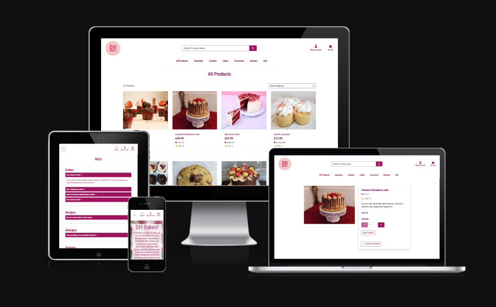

# DH Bakes - Local Bakery eCommerce Website

Welcome to DH Bakes, a fully-functional eCommerce platform for a local bakery, offering customers the convenience of browsing, ordering, and requesting custom delicious baked goods online. Whether you're looking for a custom cake for a special occasion or simply want to indulge in fresh pastries, DH Bakes provides a user-friendly experience for everyone.

The site was built using HTML, CSS, JavaScript/JQuery and Python (Using the Django Framework)

Users can experience the site in full, viewing all products with the various filter options, subscribe to newsletters and offers, check out FAQ's and Testimonials, along with adding their own reviews and sending messages to the store owners. Users can view recipes uploaded by the store owners so they can also bake their own cakes at home.

The site has a fully functional payment/checkout system, allowing users to create a profile which saves their data to and their previous order history. All users will receive order confirmation emails as long as a real email is added for checkout.

DH Bakes is built with responsive design in mind and can be used on a variety of screen sizes.

The Live Site can be found [Here](https://dh-bakes-e0dca18717d0.herokuapp.com/)

