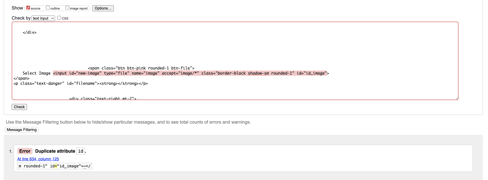
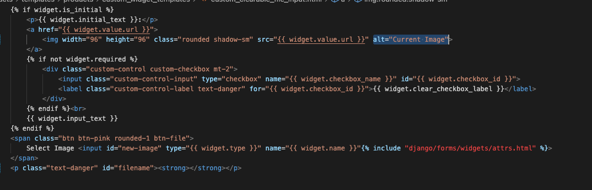
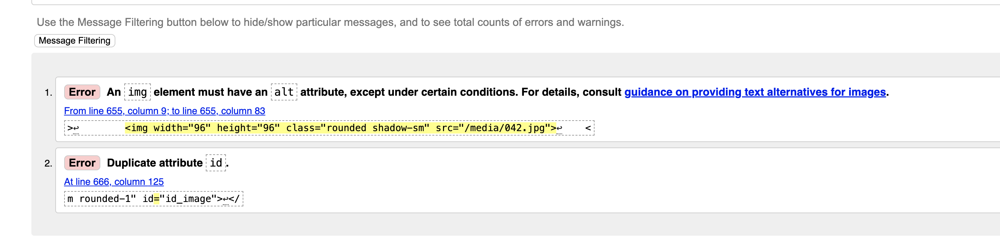
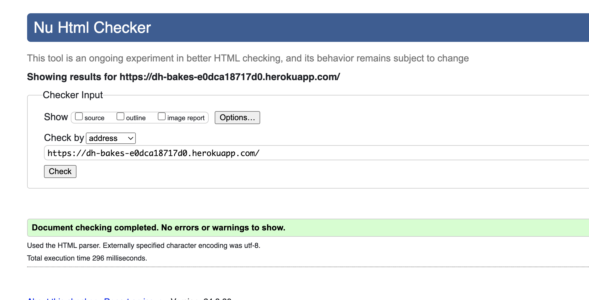
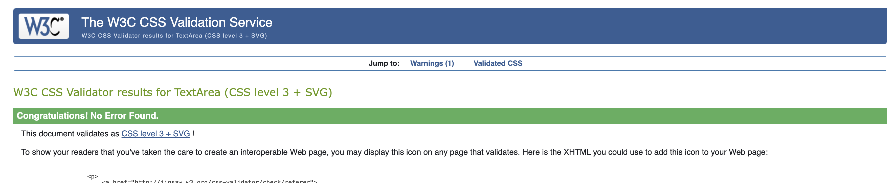
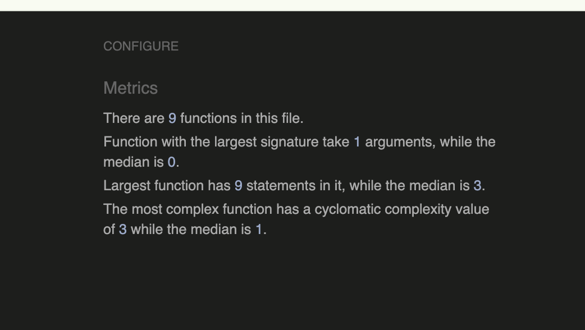

# Documented Manual Testing for | DH Bakes (E-commerce Application)

This project was tested throughout the duration of the project creation. This was done with ensuring the user story / feature was designed and working as intended when being coded.
The project was also tested frequently via Google Chrome Dev Tools for display issues and terminal issues.

User Story Testing is documented below along with other manual process testing to ensure the overall operation of the website works correctly.

## Validation Testing

### HTML Files

All Html pages were tested using [W3C Schools validator](https://validator.w3.org/) in logged in and logged out state.

All pages were viewed via the deployed site, navigating from the home page through to all other pages, right clicking and selecting 'View Page Source' copying this code directly into the HTML Checker.

The only outstanding issues I encountered were related to the 'custom_clearable_file_input.html' which is show below:

I tried to resolve as many as I could, but the duplicate ID was not able to be fixed:

I added an ALT to the image, but the error would not remove itself:

All other issues were resolved and the HTML files now pass checks.

### CSS Files

All CCS Files were tested using [W3C Schools CCS Validator](https://jigsaw.w3.org/css-validator/)

Tests came back with no errors first time.

### JavaScript Files

All additional JS files and script sections in HTML Files were tested using [JSHint](https://jshint.com/)

Any errors were fixed so all pass checks.

### Python Files

Python files were checked using the [CI PEP8 Linter](https://pep8ci.herokuapp.com/)

Most errors were due to spacing and lines to long, all of these were resolved. Below shows each app and the file tested.