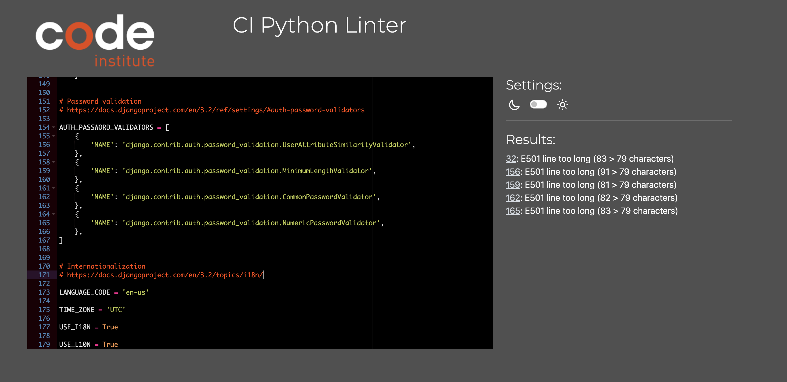
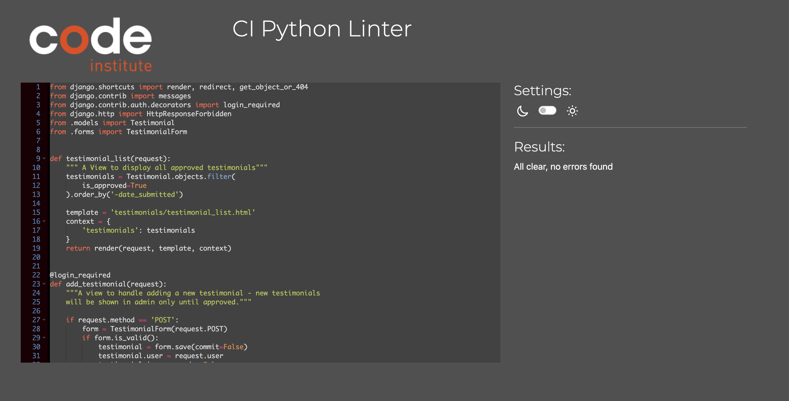
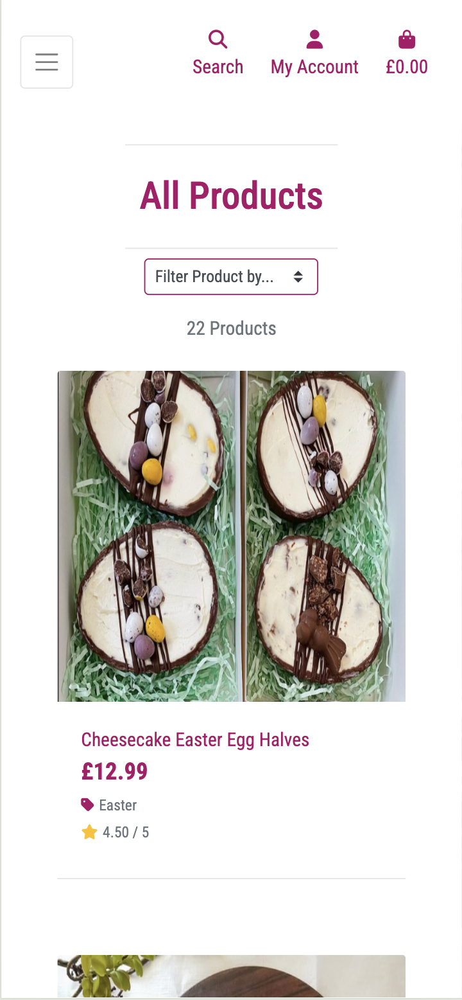
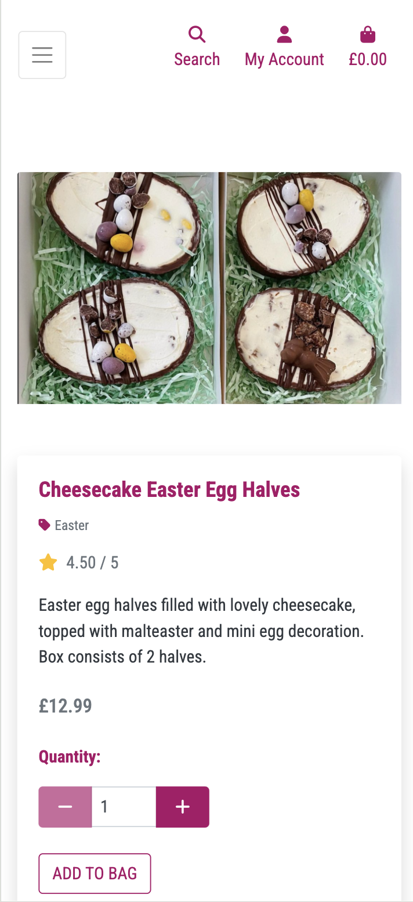
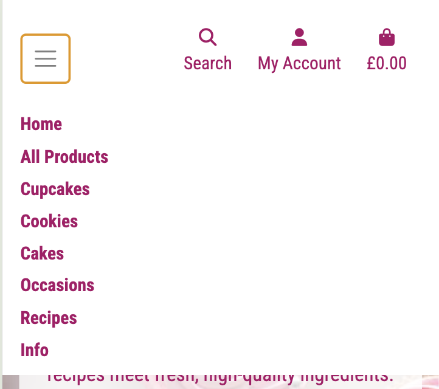
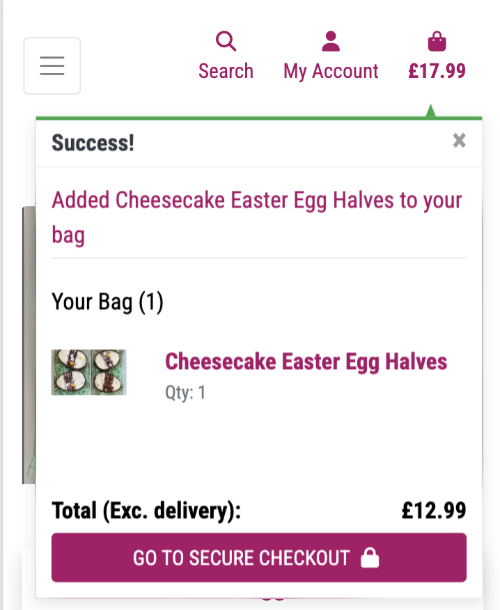
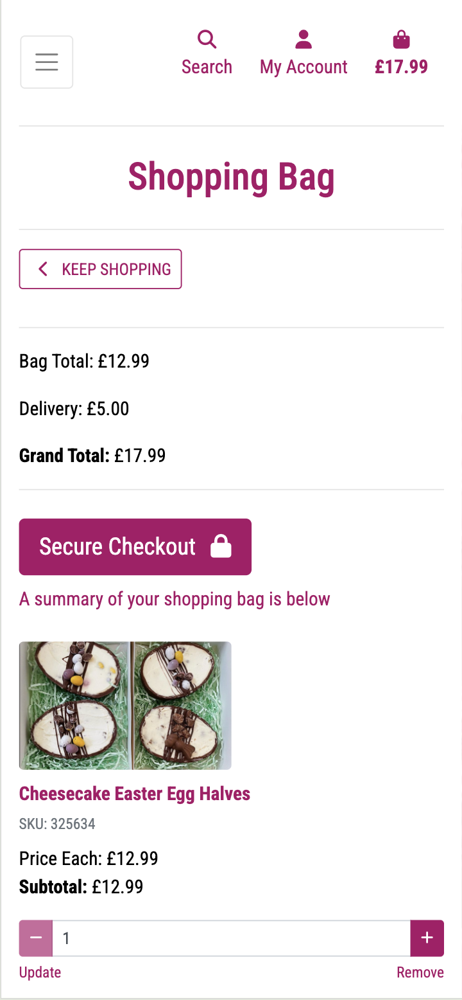
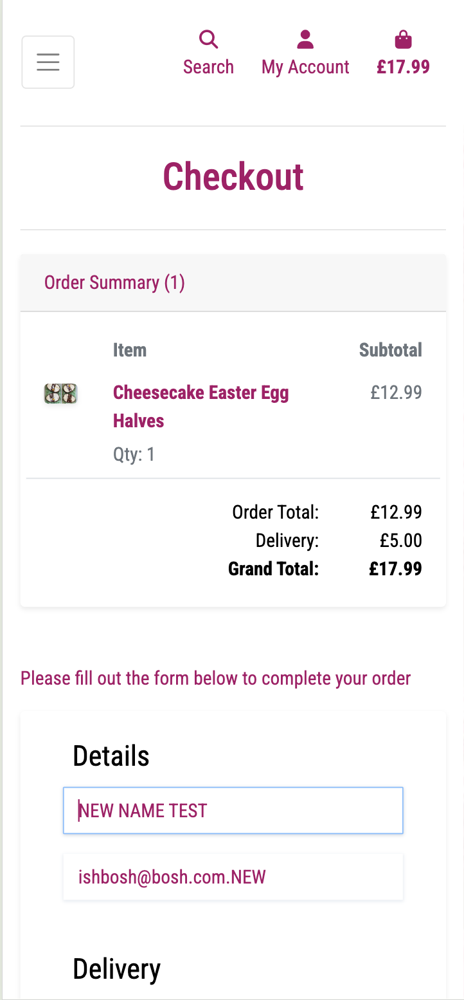
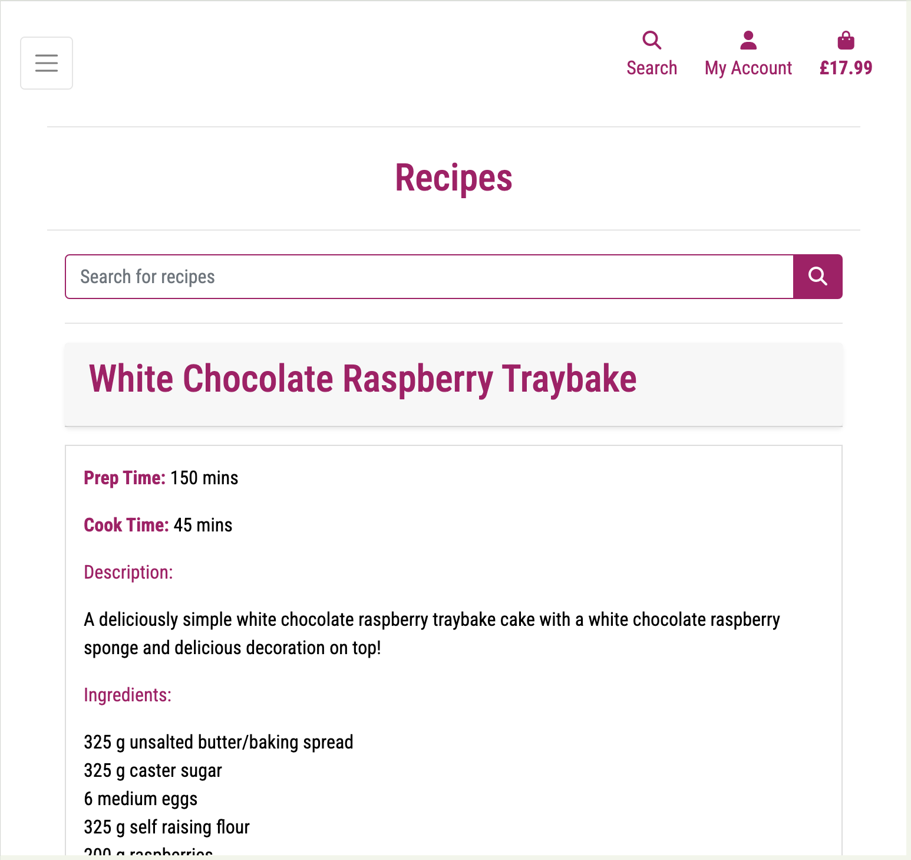
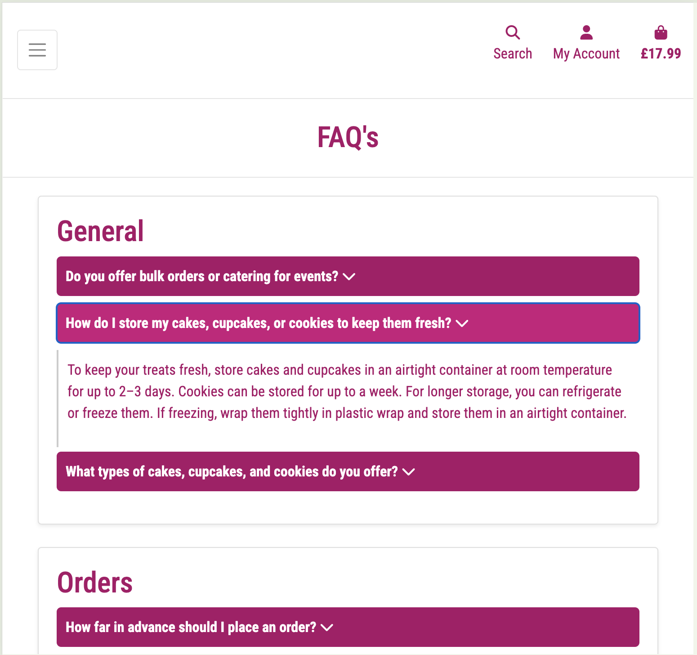

# Documented Manual Testing for | DH Bakes (E-commerce Application)

This project was tested throughout the duration of the project creation. This was done with ensuring the user story / feature was designed and working as intended when being coded.
The project was also tested frequently via Google Chrome Dev Tools for display issues and terminal issues.

User Story Testing is documented below along with other manual process testing to ensure the overall operation of the website works correctly.

## Validation Testing

### HTML Files

All Html pages were tested using [W3C Schools validator](https://validator.w3.org/) in logged in and logged out state.

All pages were viewed via the deployed site, navigating from the home page through to all other pages, right clicking and selecting 'View Page Source' copying this code directly into the HTML Checker.

The only outstanding issues I encountered were related to the 'custom_clearable_file_input.html' which is show below:

I tried to resolve as many as I could, but the duplicate ID was not able to be fixed:

I added an ALT to the image, but the error would not remove itself:

All other issues were resolved and the HTML files now pass checks.

### CSS Files

All CCS Files were tested using [W3C Schools CCS Validator](https://jigsaw.w3.org/css-validator/)

Tests came back with no errors first time.

### JavaScript Files

All additional JS files and script sections in HTML Files were tested using [JSHint](https://jshint.com/)

Any errors were fixed so all pass checks.

### Python Files

Python files were checked using the [CI PEP8 Linter](https://pep8ci.herokuapp.com/)

Most errors were due to spacing and lines to long, all of these were resolved. Below shows each app and the file tested.

| File Name                                        | Expected                         | Actual                                                                                                                                                                                                                                                                                                 | Result |
| ------------------------------------------------ | -------------------------------- | ------------------------------------------------------------------------------------------------------------------------------------------------------------------------------------------------------------------------------------------------------------------------------------------------------ | ------ |
| DH_BAKES                                         |
| [asgi.py](http://asgi.py/)                       | CI Python Linter Shows No Errors |                                                                                                                                                                                                                                                                                                        | Pass   |
| [settings.py](http://settings.py/)               | CI Python Linter Shows No Errors | Some lines were too long but could not alter due to setup. 32: E501 line too long (83 > 79 characters) 156: E501 line too long (91 > 79 characters) 159: E501 line too long (81 > 79 characters) 162: E501 line too long (82 > 79 characters) 165: E501 line too long (83 > 79 characters) |        |
| [urls.py](http://urls.py/)                       | CI Python Linter Shows No Errors | CI Python Linter Shows No Errors                                                                                                                                                                                                                                                                       | Pass   |
| [views.py](http://views.py/)                     | CI Python Linter Shows No Errors | CI Python Linter Shows No Errors                                                                                                                                                                                                                                                                       | Pass   |
| [wsgi.py](http://wsgi.py/)                       | CI Python Linter Shows No Errors | CI Python Linter Shows No Errors                                                                                                                                                                                                                                                                       | Pass   |
| BAG                                              |
| [apps.py](http://apps.py/)                       | CI Python Linter Shows No Errors | CI Python Linter Shows No Errors                                                                                                                                                                                                                                                                       | Pass   |
| [contexts.py](http://contexts.py/)               | CI Python Linter Shows No Errors | CI Python Linter Shows No Errors                                                                                                                                                                                                                                                                       | Pass   |
| [urls.py](http://urls.py/)                       | CI Python Linter Shows No Errors | CI Python Linter Shows No Errors                                                                                                                                                                                                                                                                       | Pass   |
| [views.py](http://views.py/)                     | CI Python Linter Shows No Errors | CI Python Linter Shows No Errors                                                                                                                                                                                                                                                                       | Pass   |
| CHECKOUT                                         |
| [admin.py](http://admin.py/)                     | CI Python Linter Shows No Errors | CI Python Linter Shows No Errors                                                                                                                                                                                                                                                                       | Pass   |
| [apps.py](http://apps.py/)                       | CI Python Linter Shows No Errors | CI Python Linter Shows No Errors                                                                                                                                                                                                                                                                       | Pass   |
| [forms.py](http://forms.py/)                     | CI Python Linter Shows No Errors | CI Python Linter Shows No Errors                                                                                                                                                                                                                                                                       | Pass   |
| [models.py](http://models.py/)                   | CI Python Linter Shows No Errors | CI Python Linter Shows No Errors                                                                                                                                                                                                                                                                       | Pass   |
| [signals.py](http://signals.py/)                 | CI Python Linter Shows No Errors | CI Python Linter Shows No Errors                                                                                                                                                                                                                                                                       | Pass   |
| [urls.py](http://urls.py/)                       | CI Python Linter Shows No Errors | CI Python Linter Shows No Errors                                                                                                                                                                                                                                                                       | Pass   |
| [webhook-handler.py](http://webhook-handler.py/) | CI Python Linter Shows No Errors | CI Python Linter Shows No Errors                                                                                                                                                                                                                                                                       | Pass   |
| [webhooks.py](http://webhooks.py/)               | CI Python Linter Shows No Errors | CI Python Linter Shows No Errors                                                                                                                                                                                                                                                                       | Pass   |
| CONTACT                                          |
| [admin.py](http://admin.py/)                     | CI Python Linter Shows No Errors | CI Python Linter Shows No Errors                                                                                                                                                                                                                                                                       | Pass   |
| [apps.py](http://apps.py/)                       | CI Python Linter Shows No Errors | CI Python Linter Shows No Errors                                                                                                                                                                                                                                                                       | Pass   |
| [forms.py](http://forms.py/)                     | CI Python Linter Shows No Errors | CI Python Linter Shows No Errors                                                                                                                                                                                                                                                                       | Pass   |
| [models.py](http://models.py/)                   | CI Python Linter Shows No Errors | CI Python Linter Shows No Errors                                                                                                                                                                                                                                                                       | Pass   |
| [urls.py](http://urls.py/)                       | CI Python Linter Shows No Errors | CI Python Linter Shows No Errors                                                                                                                                                                                                                                                                       | Pass   |
| [views.py](http://views.py/)                     | CI Python Linter Shows No Errors | CI Python Linter Shows No Errors                                                                                                                                                                                                                                                                       | Pass   |
| FAQ                                              |
| [admin.py](http://admin.py/)                     | CI Python Linter Shows No Errors | CI Python Linter Shows No Errors                                                                                                                                                                                                                                                                       | Pass   |
| [apps.py](http://apps.py/)                       | CI Python Linter Shows No Errors | CI Python Linter Shows No Errors                                                                                                                                                                                                                                                                       | Pass   |
| [models.py](http://models.py/)                   | CI Python Linter Shows No Errors | CI Python Linter Shows No Errors                                                                                                                                                                                                                                                                       | Pass   |
| [urls.py](http://urls.py/)                       | CI Python Linter Shows No Errors | CI Python Linter Shows No Errors                                                                                                                                                                                                                                                                       | Pass   |
| [views.py](http://views.py/)                     | CI Python Linter Shows No Errors | CI Python Linter Shows No Errors                                                                                                                                                                                                                                                                       | Pass   |
| PRODUCTS                                         |
| [admin.py](http://admin.py/)                     | CI Python Linter Shows No Errors | CI Python Linter Shows No Errors                                                                                                                                                                                                                                                                       | Pass   |
| [apps.py](http://apps.py/)                       | CI Python Linter Shows No Errors | CI Python Linter Shows No Errors                                                                                                                                                                                                                                                                       | Pass   |
| [forms.py](http://forms.py/)                     | CI Python Linter Shows No Errors | CI Python Linter Shows No Errors                                                                                                                                                                                                                                                                       | Pass   |
| [models.py](http://models.py/)                   | CI Python Linter Shows No Errors | CI Python Linter Shows No Errors                                                                                                                                                                                                                                                                       | Pass   |
| [urls.py](http://urls.py/)                       | CI Python Linter Shows No Errors | CI Python Linter Shows No Errors                                                                                                                                                                                                                                                                       | Pass   |
| [views.py](http://views.py/)                     | CI Python Linter Shows No Errors | CI Python Linter Shows No Errors                                                                                                                                                                                                                                                                       | Pass   |
| [widgets.py](http://widgets.py/)                 | CI Python Linter Shows No Errors | CI Python Linter Shows No Errors                                                                                                                                                                                                                                                                       | Pass   |
| PROFILES                                         |
| [apps.py](http://apps.py/)                       | CI Python Linter Shows No Errors | CI Python Linter Shows No Errors                                                                                                                                                                                                                                                                       | Pass   |
| [forms.py](http://forms.py/)                     | CI Python Linter Shows No Errors | CI Python Linter Shows No Errors                                                                                                                                                                                                                                                                       | Pass   |
| [models.py](http://models.py/)                   | CI Python Linter Shows No Errors | CI Python Linter Shows No Errors                                                                                                                                                                                                                                                                       | Pass   |
| [urls.py](http://urls.py/)                       | CI Python Linter Shows No Errors | CI Python Linter Shows No Errors                                                                                                                                                                                                                                                                       | Pass   |
| [views.py](http://views.py/)                     | CI Python Linter Shows No Errors | CI Python Linter Shows No Errors                                                                                                                                                                                                                                                                       | Pass   |
| RECIPES                                          |
| [admin.py](http://admin.py/)                     | CI Python Linter Shows No Errors | CI Python Linter Shows No Errors                                                                                                                                                                                                                                                                       | Pass   |
| [apps.py](http://apps.py/)                       | CI Python Linter Shows No Errors | CI Python Linter Shows No Errors                                                                                                                                                                                                                                                                       | Pass   |
| [models.py](http://models.py/)                   | CI Python Linter Shows No Errors | CI Python Linter Shows No Errors                                                                                                                                                                                                                                                                       | Pass   |
| [urls.py](http://urls.py/)                       | CI Python Linter Shows No Errors | CI Python Linter Shows No Errors                                                                                                                                                                                                                                                                       | Pass   |
| [views.py](http://views.py/)                     | CI Python Linter Shows No Errors | CI Python Linter Shows No Errors                                                                                                                                                                                                                                                                       | Pass   |
| TESTIMONIALS                                     |
| [apps.py](http://apps.py/)                       | CI Python Linter Shows No Errors | CI Python Linter Shows No Errors                                                                                                                                                                                                                                                                       | Pass   |
| [forms.py](http://forms.py/)                     | CI Python Linter Shows No Errors | CI Python Linter Shows No Errors                                                                                                                                                                                                                                                                       | Pass   |
| [models.py](http://models.py/)                   | CI Python Linter Shows No Errors | CI Python Linter Shows No Errors                                                                                                                                                                                                                                                                       | Pass   |
| [urls.py](http://urls.py/)                       | CI Python Linter Shows No Errors | CI Python Linter Shows No Errors                                                                                                                                                                                                                                                                       | Pass   |
| [views.py](http://views.py/)                     | CI Python Linter Shows No Errors | CI Python Linter Shows No Errors                                                                                                                                                                                                                                                                       | Pass   |

## User Story Testing

| User Story                                                           | Test                                                                                                                                                                       | Action                                                                                                                                                                                                                         | Expected                                                                                                                                                                                                                                                                            | Result (Pass/Fail) |
| -------------------------------------------------------------------- | -------------------------------------------------------------------------------------------------------------------------------------------------------------------------- | ------------------------------------------------------------------------------------------------------------------------------------------------------------------------------------------------------------------------------ | ----------------------------------------------------------------------------------------------------------------------------------------------------------------------------------------------------------------------------------------------------------------------------------- | ------------------ |
| [User Story 1](https://github.com/philtipping31/DH-Bakes/issues/1)   | A site visitor can easily navigate to the site, and view all products                                                                                                      | Go to the website as a logged out user and click 'All Products' - Same action taken for a logged in user                                                                                                                       | All products are visible to the user                                                                                                                                                                                                                                                | Pass               |
| [User Story 1](https://github.com/philtipping31/DH-Bakes/issues/1)   | A site visitor can select products to purchase                                                                                                                             | Go to the site as a logged in and logged out user and each product can be viewed.                                                                                                                                              | Each product can be viewed, opening the product detail page                                                                                                                                                                                                                         | Pass               |
| [User Story 2](https://github.com/philtipping31/DH-Bakes/issues/2)   | Each product can be viewed individually when clicked on                                                                                                                    | View all products and select one product. This should open up the product detail allowing the user to look at the item in more detail. Check that the image is shown, the user can adjust the quantity. (1 being the minimum). | Product can be viewed individually with picture/price and quantity option                                                                                                                                                                                                           | Pass               |
| [User Story 3](https://github.com/philtipping31/DH-Bakes/issues/3)   | Follow full register process.                                                                                                                                              | Access 'My Account' > Register and sign up for an account. Once Signed up an email is sent to the user to verify their email. Once verified user can login to their account                                                    | All functions of the registration work and user can sign up and login to their new account. All actions are shown as pop up messages to the user                                                                                                                                    | Pass               |
| [User Story 4](https://github.com/philtipping31/DH-Bakes/issues/4)   | Check the search bar brings up items based on search criteria                                                                                                              | Type in part or all of a word that matches to a product name/description                                                                                                                                                       | Filters products appear that match the search criteria                                                                                                                                                                                                                              | Pass               |
| [User Story 4](https://github.com/philtipping31/DH-Bakes/issues/4)   | If no search criteria entered, error shows but displays all products                                                                                                       | Click the search bar with no search criteria entered                                                                                                                                                                           | All product page shows up but error message notifies the user of an unrecognised search criteria entered                                                                                                                                                                            | Pass               |
| [User Story 4](https://github.com/philtipping31/DH-Bakes/issues/4)   | If no search criteria matches a product, all products page is shown with a 0 results text                                                                                  | Type in a word that does not match and product into the search bar                                                                                                                                                             | All products page shows with no results. Text shows on the page that there is 0 results found for 'X'                                                                                                                                                                               | Pass               |
| [User Story 5](https://github.com/philtipping31/DH-Bakes/issues/5)   | User with an active account can login and logout of their account via 'My Account'                                                                                         | Use the Login option from my account and login. Once logged in go back to My Account and use the logout option                                                                                                                 | User can login and logout of the site                                                                                                                                                                                                                                               | Pass               |
| [User Story 5](https://github.com/philtipping31/DH-Bakes/issues/5)   | Once logged in, user has access to My Profile which allows them to view/update their details and see order history if applicable                                           | Login and navigate to my profile via the my account dropdown                                                                                                                                                                   | Correctly shows form for personal details and a section for order history.                                                                                                                                                                                                          | Pass               |
| [User Story 6](https://github.com/philtipping31/DH-Bakes/issues/6)   | All pages throughout the site use the base.html file and the content is loaded in                                                                                          | View each page to ensure base.html is loading in correctly                                                                                                                                                                     | All pages follow the base.html layout and style                                                                                                                                                                                                                                     | Pass               |
| [User Story 7](https://github.com/philtipping31/DH-Bakes/issues/7)   | Users can filter products based on the selection of sorting options                                                                                                        | Go to all products and choose the filter option. Change the filter for each option to show the products in the correct order based on the criteria selected                                                                    | Products display in the correct order based on the criteria chosen                                                                                                                                                                                                                  | Pass               |
| [User Story 8](https://github.com/philtipping31/DH-Bakes/issues/8)   | Products can be added to the bag                                                                                                                                           | View a product and click add to bag                                                                                                                                                                                            | Product is successfully added to the bag                                                                                                                                                                                                                                            | Pass               |
| [User Story 8](https://github.com/philtipping31/DH-Bakes/issues/8)   | Product quantity can be adjusted on detailed view and the amount chosen is added to the bag                                                                                | Adjust the quantity of a product and click add to bag                                                                                                                                                                          | The selected quantity is successfully added to the bag                                                                                                                                                                                                                              | Pass               |
| [User Story 8](https://github.com/philtipping31/DH-Bakes/issues/8)   | Message shows up when item is added to the bag along with bag preview                                                                                                      | Follow the same actions as above for the user story 8                                                                                                                                                                          | User is notifed that the item was successfully added to the bag along with their bag preview.                                                                                                                                                                                       | Pass               |
| [User Story 9](https://github.com/philtipping31/DH-Bakes/issues/9)   | User is directed to the shopping bag when clicking the cart option                                                                                                         | Click on the shopping bag icon                                                                                                                                                                                                 | Shopping bag view is shown to the user                                                                                                                                                                                                                                              | Pass               |
| [User Story 9](https://github.com/philtipping31/DH-Bakes/issues/9)   | User can see all items they've added to their cart, if nothing added, empty shopping bag message is shown                                                                  | Add items to bag and click on shopping bag icon / remove all items and view shopping bag                                                                                                                                       | User can see all added items when going to the shopping bag, if nothing added empty bag page is shown.                                                                                                                                                                              | Pass               |
| [User Story 9](https://github.com/philtipping31/DH-Bakes/issues/9)   | User can update and remove items from their shopping bag                                                                                                                   | Add items to the bag and adjust the quantity and remove.                                                                                                                                                                       | Items are correctly adjusted based on action                                                                                                                                                                                                                                        | Pass               |
| [User Story 10](https://github.com/philtipping31/DH-Bakes/issues/10) | Once logged in, a user can navigate to the profile page and add their details                                                                                              | Add details to a logged in users profile and save the form                                                                                                                                                                     | Form saves successfully to the profile and notifies the user                                                                                                                                                                                                                        | Pass               |
| [User Story 10](https://github.com/philtipping31/DH-Bakes/issues/10) | Place an order as a logged in user with saved details to see if the order form prepoluates based on profile info                                                           | Go to the checkout page after saving details to the profile                                                                                                                                                                    | Checkout form prepoplutates with the profile infomation                                                                                                                                                                                                                             | Pass               |
| [User Story 10](https://github.com/philtipping31/DH-Bakes/issues/10) | Once an order has been placed it shows in the order history in the profile                                                                                                 | Place an order and navgiate to the profile page                                                                                                                                                                                | Once an order has been placed successfully, order confirmation is displayed and user can navigate back to their profile to see their order history along with the option to view the order confirmation again                                                                       | Pass               |
| [User Story 10](https://github.com/philtipping31/DH-Bakes/issues/10) | Any changes made on the check out form save to the profile page as long as the checkbox is ticked                                                                          | Make a change to the checkout form and make sure checkbox is ticked                                                                                                                                                            | Once the order is placed, the updated info for the user can now be seen on the profile page                                                                                                                                                                                         | Pass               |
| [User Story 11](https://github.com/philtipping31/DH-Bakes/issues/11) | Check that once the checkout process is completed, the order confirmation is shown to the user with the order number.                                                      | Add items to the bag and complete the check out. If the checkout is successful, the order confirmation screen is shown to the user.                                                                                            | Order confirmation shows correctly with all details of the order and delivery                                                                                                                                                                                                       | Pass               |
| [User Story 12](https://github.com/philtipping31/DH-Bakes/issues/12) | Emails are actually sent from the site for order confirmations and login facilities                                                                                        | Complete an order with a correct email address and check that an email is sent to the email address given on check out                                                                                                         | Emails are successfully sent to the user                                                                                                                                                                                                                                            | Pass               |
| [User Story 12](https://github.com/philtipping31/DH-Bakes/issues/12) | Emails are actually sent from the site for order confirmations and login facilities                                                                                        | Request password resets, and check that the email with the password reset link is sent to the email address given / register for an account and check the email to confirm the email address is emailed to the user            | Emails are successfully sent to the user                                                                                                                                                                                                                                            | Pass               |
| [User Story 13](https://github.com/philtipping31/DH-Bakes/issues/13) | As an admin user, product management can be accessed from the 'My Account' dropdown allowing the admin user to add new items directly to the store                         | Login as an admin user and go to Product Management. A product can be directlly added from the website to the products page                                                                                                    | Only admin users can access the product management page and once a product is added it can be seen on site                                                                                                                                                                          | Pass               |
| [User Story 13](https://github.com/philtipping31/DH-Bakes/issues/13) | As an admin user, product management can be accessed from the 'My Account' dropdown allowing the admin user to view all current items in the store and edit or delete them | Use the helpful product list and use the edit option to update an exisiting product. And do the same to delete a product                                                                                                       | Store owners with admin access can edit and delete products from the store front end site without the use of the admin panel                                                                                                                                                        | Pass               |
| [User Story 14](https://github.com/philtipping31/DH-Bakes/issues/14) | Users can access the contact us form from the 'Info' drop down option                                                                                                      | Fill out the contact us form incorrectly to check for form error prompts / fill in the contact us form correctly and check the form is sent successfully and appears in the django admin panel                                 | Form errors show correctly when required fields are left empty. Correct form submission sends successfully notifying the user and appears on the admin panel.                                                                                                                       | Pass               |
| [User Story 15](https://github.com/philtipping31/DH-Bakes/issues/15) | Users can view Testimonials from the Info drop down                                                                                                                        | Navigate to Info > Testimonials                                                                                                                                                                                                | The Testimonials page shows properly listing all testiminials approved for the site                                                                                                                                                                                                 | Pass               |
| [User Story 15](https://github.com/philtipping31/DH-Bakes/issues/15) | Not logged in users can't add testimonials to the site                                                                                                                     | Try to add a testimonial when not logged in                                                                                                                                                                                    | If a user is not logged in, they can't add a testimonial and it takes them to the login page                                                                                                                                                                                        | Pass               |
| [User Story 15](https://github.com/philtipping31/DH-Bakes/issues/15) | Logged in users can add testimonials to the site                                                                                                                           | Try to add a testimonial as a logged in user                                                                                                                                                                                   | User can add a tesitmonial, subject to a correct form submission. The form is submitted to the admin panel and awaits approval before showing on site - this is notified to the user                                                                                                | Pass               |
| [User Story 15](https://github.com/philtipping31/DH-Bakes/issues/15) | Users can edit and delete their own tesitmonials                                                                                                                           | When logged in after adding an approved testimonial, the edit/delete buttons appear on their own testimonials                                                                                                                  | Edit and delete buttons only show on logged in users testimonials. When clicking edit, the testimonial appears and allows edits, but will wait to be reapproved. Clicking delete, takes them to a confirm delete testimonial page which allows them to remove their own testimonial | Pass               |
| [User Story 15](https://github.com/philtipping31/DH-Bakes/issues/15) | Users cant edit/delete other user testimonials                                                                                                                             | Log out and copy a URL to edit/delete a testominial                                                                                                                                                                            | User gets a 403 page and error message if they try to edit and delete a testimonial that is not their own                                                                                                                                                                           | Pass               |
| [User Story 16](https://github.com/philtipping31/DH-Bakes/issues/16) | Users can few a list of frequently asked questions from the info dropdown                                                                                                  | Go to the FAQ's option via the info drop down and view all of the FAQ's                                                                                                                                                        | FAQ's show, the answers correctly show when the question is clicked on.                                                                                                                                                                                                             | Pass               |
| [User Story 16](https://github.com/philtipping31/DH-Bakes/issues/16) | FAQ's can be added,edited and deleted from the django admin panel                                                                                                          | Login to Django admin and perfrom full CRUD successfully for FAQ's                                                                                                                                                             | FAQ's can be added, edit and deleted from the admin panel                                                                                                                                                                                                                           | Pass               |
| [User Story 17](https://github.com/philtipping31/DH-Bakes/issues/17) | All site users can access the recipes page.                                                                                                                                | Click on the Recipes option from the navbar and check it correctly goes to the recipes page. Details are shown of the recipe, 1 per page with pagination in place for users to cycle through all recipes                       | Recipe page correctly displays when clicked on via the navbar                                                                                                                                                                                                                       | Pass               |
| [User Story 17](https://github.com/philtipping31/DH-Bakes/issues/17) | Search bar allows users to search for keywords to filter the list of recipe options displayed                                                                              | Add search criteria for a recipe that exisits and one that doesnt                                                                                                                                                              | If search criteria matches a recipe on site, they will show to the user. If no matches, user is shown a message stating nothing matched                                                                                                                                             | Pass               |
| [User Story 17](https://github.com/philtipping31/DH-Bakes/issues/17) | Recipes can be added, edited and deleted from the admin panel                                                                                                              | Add a new recipe / edt an existing recipe and delete a recipe from the admin site                                                                                                                                              | Full CRUD can be perfromed via the admin panel                                                                                                                                                                                                                                      | Pass               |
| [User Story 18](https://github.com/philtipping31/DH-Bakes/issues/18) | Facebook and Instagram pages can be accessed via the page footer                                                                                                           | Click on the Facebook and Insta icons on the footer to check they go to the correct location (Opens social media page in new tab)                                                                                              | The footer is on all pages and the facebook and Instagram links go directly to the DH Bakes Facebook an Insta pages                                                                                                                                                                 | Pass               |
| [User Story 19](https://github.com/philtipping31/DH-Bakes/issues/19) | Mailchimp Integrated to the site, allowing site visitors to enter their email address to subscribe for updates                                                             | Enter an email address onto the mailchimp section located on the home page. Check the success message shows and the new email address is viewed in the mailchimp site                                                          | Users can add their email address from the site which is sent over to Mailchimp                                                                                                                                                                                                     | Pass               |
| [User Story 20](https://github.com/philtipping31/DH-Bakes/issues/20) | Check that the 403 page shows when intended                                                                                                                                | In deployed environment logout of a profile and copy the URL to delete/edit a testimonial                                                                                                                                      | 403 page displays as the user is not authenticated to perfrom this action                                                                                                                                                                                                           | Pass               |
| [User Story 20](https://github.com/philtipping31/DH-Bakes/issues/20) | Check that the 404 page shows when intended                                                                                                                                | In deployed envrionment, append characters onto the URL and attempt to go to an incorrect URL                                                                                                                                  | 404 page displayss to the user as the URL they entered does not exist                                                                                                                                                                                                               | Pass               |
| [User Story 20](https://github.com/philtipping31/DH-Bakes/issues/20) | Check that the 500 page shows when intended                                                                                                                                | In deployed environment, remove a config var, load the page up and go to 'Products                                                                                                                                             | 500 page correctly displays as there is an internal server error which can't display the page correctly.                                                                                                                                                                            | Pass               |
| [User Story 21](https://github.com/philtipping31/DH-Bakes/issues/21) | Nav Bar works correctly on laptops and mobiles                                                                                                                             | Test all links go to the correct page based on logged in and logged out setup as well as admin profiles. The nav bar is collapsed and is still accessible on mobile/tablet with the correct options showing                    | All links go to the correct page and show correctly based on logged in or logged out setup.                                                                                                                                                                                         | Pass               |
| [User Story 22](https://github.com/philtipping31/DH-Bakes/issues/22) | Product categories are shown in the nav bar allowing users to choose a specific type of product they want to view                                                          | Go through all product nav options and check the correct products show based on category selected                                                                                                                              | All products filter by category as expected                                                                                                                                                                                                                                         | Pass               |
| [User Story 23](https://github.com/philtipping31/DH-Bakes/issues/23) | Checkout facility is full functional allowing users to check out and submit orders                                                                                         | Add items to the bag and complete the check out process with adding card details and delivery details                                                                                                                          | Customers can checked out whether they're logged in or logged out of the site                                                                                                                                                                                                       | Pass               |
| [User Story 24](https://github.com/philtipping31/DH-Bakes/issues/24) | Users can add card details using the Stripe integration on the checkout page                                                                                               | Add the test card number and checkout. Order goes through and the payment details are showing successfully in the stripe webpage                                                                                               | Stripe works and collects payment data correctly upon checkout                                                                                                                                                                                                                      | Pass               |
| [User Story 27](https://github.com/philtipping31/DH-Bakes/issues/27) | META tags are added to the site to improve the sites searchability on Google                                                                                               | Go to base.html and check for description and keyword meta tags are showing that correcetly reflect the sites purpose                                                                                                          | Meta tags added                                                                                                                                                                                                                                                                     | Pass               |
| [User Story 27](https://github.com/philtipping31/DH-Bakes/issues/27) | Robots.txt file is added                                                                                                                                                   | Robots.txt file is added to IDE                                                                                                                                                                                                | robots.txt file added                                                                                                                                                                                                                                                               | Pass               |
| [User Story 27](https://github.com/philtipping31/DH-Bakes/issues/27) | sitemaps.xml has been added                                                                                                                                                | sitemaps.xml has been added to IDE                                                                                                                                                                                             | sitemaps file added                                                                                                                                                                                                                                                                 | Pass               |

## Other Tests

The site has been tested on an iPhone13 Pro to check that the Chrome Dev tools responsiveness options are correct and to check that a site visitor can view the website and all pages with ease on a mobile device.

All links/buttons have been tested to ensure that the user can navigate around the site as the intend.

Check that toast messages show up to the user when they perform actions that require user notifications.

Security testing - ensure users without an account / ownership of content / admin access can't access pages using the URL necessary, implementing the 403 page for better UX

### Responsiveness 

As above, chrome dev tools responsive option was used throughout the development of this site, ensure a mobile first approach was taken. The site can be used as normal on mobiles/tablets as well as large laptop screens.

Mobile and Tablet views:

Home Page

Mobile Products 

Mobile Product View 

Mobile Menu

Bag Preview

Mobile Bag

Mobile Checkout

Tablet Recipe

Tablet FAQ's

## Bugs/Issues

I have three contrast issues flagged up on WAVE when testing the project, however I am unable to see where these are so i've had to leave these issues.

All other bugs/issues found during manual testing were fixed and changed in the code to avoid the problem happening further